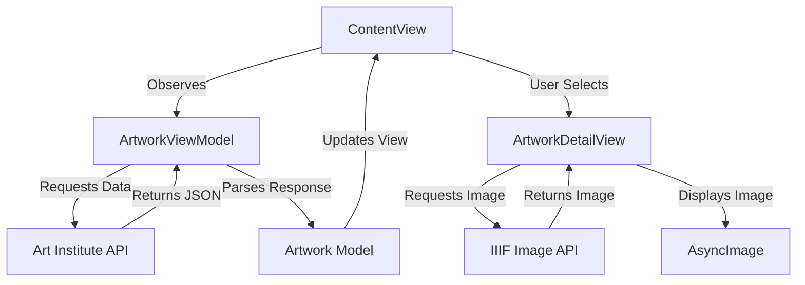
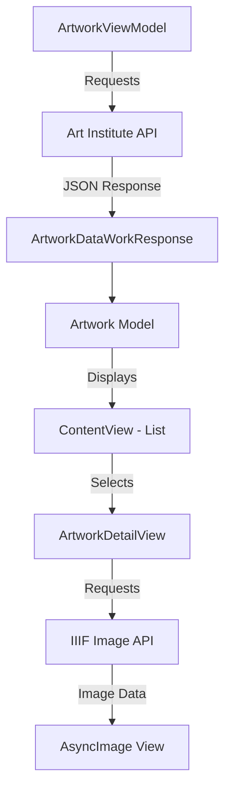

# iOS App - Art Institute of Chicago
https://img.shields.io/badge/Swift-5.9-orange.svg
https://img.shields.io/badge/platform-iOS-blue.svg

Explore the vast collection of artworks from the Art Institute of Chicago directly on your iOS device. This SwiftUI application provides a seamless browsing experience with paginated loading and detailed artwork views using the museum's public API.

## Features

📜 **Paginated Artwork List** - Infinite scrolling with automatic loading  
🔢 **Page Navigation** - Jump to specific pages with page number input  
🖼️ **High-Resolution Images** - IIIF protocol for optimised image delivery  
📱 **Modern SwiftUI Interface** - Clean, responsive design  
⚡️ **Efficient Data Handling** - Combine framework for API requests  
🧩 **MVVM Architecture** - Well-structured code separation  
🔄 **Real-time Pagination Tracking** - Current page and total pages display  

## Diagram 1: Basic Flow



## Diagram 2: Detailed Data Flow



## Requirements

iOS 16.0+
Xcode 15.0+
Swift 5.9+

## Installation

### Clone the repository:
bash 
git clone https://github.com/AleksandrVinnik/Art-Institute-of-Chicago

### Open the project in Xcode:
bash 
cd art-institute-explorer

open Art\ Institute\ of\ Chicago.xcodeproj

Build and run the project (⌘ + R)

## Usage

### Browsing Artworks

The main screen displays a paginated list of artworks. 
Scroll to load more artworks automatically.

Use the page navigation at the bottom to track your position. 
Jumping to Specific Pages.

Enter a page number in the text field. 
Press "Go" to navigate directly to that page.

### Viewing Artwork Details

Tap any artwork title in the list. 
View artwork details including title and high-resolution image. 
Use the navigation bar to return to the list. 
API Reference.

This application uses the Art Institute of Chicago API:

## Artwork List Endpoint

Endpoint - GET List of artworks:
https://api.artic.edu/api/v1/artworks?page=2&limit=100
 

Endpoint - GET image by imageId:
https://www.artic.edu/iiif/2/{identifier}/full/843,/0/default.jpg

## Code Structure


```tree
src/
├── Models/
│   ├── Artwork.swift          # Codable struct
│   └── Pagination.swift       # API pagination
├── ViewModels/
│   └── ArtworkViewModel.swift # ObservableObject
├── Views/
│   ├── ContentView.swift      # NavigationStack
│   ├── ArtworkView.swift      # List item view
│   └── ArtworkDetailView.swift # AsyncImage
└── Art_Institute_of_ChicagoApp.swift # @main
```

License

Distributed under the MIT License. See LICENSE for more information.