# iOS App - Art Institute of Chicago

  


Explore the vast collection of artworks from the Art Institute of Chicago directly on your iOS device. This SwiftUI application provides a seamless browsing experience with paginated loading and detailed artwork views using the museum's public API.

---

## Features


🖼️ **Artwork Discovery** - Browse paginated collections with infinite scrolling  
🔍 **Precise Navigation** - Jump directly to specific pages  
📱 **Native iOS Experience** - Built with SwiftUI for smooth performance  
🌐 **Efficient API Integration** - Combine framework for responsive data loading  
🖌️ **High-Resolution Images** - IIIF protocol for optimized image delivery  
📊 **Pagination Tracking** - Real-time page position monitoring  

---

## Sequence Diagram 1: Data Flow Architecture

This diagram illustrates the application's data retrieval and rendering process:

```mermaid
sequenceDiagram
    participant User as 👤 User
    participant App as 📱 iOS App
    participant API as 🖼️ Art Institute API
    participant IIIF as 🖌️ IIIF Image API
    
    Note over User,IIIF: 1️⃣ Application Launch
    User->>App: Launches application
    activate App
    App->>API: 1. GET /artworks?page=1
    activate API
    API-->>App: 2. JSON response<br>(artwork metadata + pagination)
    deactivate API
    
    App->>App: 3. Parse JSON → Artwork models
    App->>App: 4. Cache metadata
    App->>User: 5. Display artwork list<br>▸ Titles only<br>▸ Pagination status
    deactivate App
    
    Note over User,IIIF: 2️⃣ Artwork Selection
    User->>App: 6. Selects artwork from list
    activate App
    App->>App: 7. Retrieve imageId: {imageId}
    App->>IIIF: 8. GET /iiif/2/{imageId}/full/843,/0/default.jpg
    activate IIIF
    IIIF-->>App: 9. Image data (JPEG)
    deactivate IIIF
    
    App->>App: 10. Decode image
    App->>User: 11. Display artwork details<br>▸ High-res image<br>▸ Title<br>▸ Navigation controls
    deactivate App
    
    Note over User,IIIF: 3️⃣ Page Navigation
    User->>App: 12. Enters page number N or Scroll Down
    activate App
    App->>App: 13. Validate input: 1 ≤ N ≤ totalPages
    App->>API: 14. GET /artworks?page=N
    activate API
    API-->>App: 15. New JSON response
    deactivate API
    
    App->>App: 16. Clear current list<br>17. Parse new data
    App->>User: 18. Update artwork list<br>▸ New artworks<br>▸ Updated pagination
    deactivate App
```


### 📲 Processing Steps Breakdown

#### 1️⃣ Application Launch Phase

- User launches iOS application  
- App sends API request for first page of artworks  
- API returns JSON with metadata and pagination info  
- App parses JSON into `Artwork` model objects  
- Displays artwork titles in list view with pagination status  

#### 2️⃣ Artwork Selection Phase

- User selects specific artwork from list  
- App retrieves image identifier (`imageId`) from model  
- Constructs IIIF URL and requests image  
- IIIF server returns optimized JPEG image data  
- App decodes image data  
- Displays detail view with image, title, and navigation controls  

#### 3️⃣ Page Navigation Phase

- User enters specific page number  
- App validates page number against total pages  
- Sends new API request for specified page  
- API returns new set of artworks  
- App clears current artwork list  
- Parses new response into models  
- Updates UI with new artworks and pagination info  

---

### 🔧 Key Technical Details

- **Image Optimization:** IIIF protocol delivers exactly sized images (843px width)  
- **Data Caching:** Artwork metadata cached locally after first fetch  
- **Input Validation:** Page numbers validated before API requests  
- **Efficient Rendering:** SwiftUI updates only changed elements in list  
- **Error Handling:** Missing images display fallback text  
- **Responsive UI:** Loading states shown during network operations  

---

### 🔍 Process Explanation (Overview)

#### Initial Request
The iOS application requests artwork metadata from the Art Institute of Chicago’s API with a specified page number for paginated results.

#### Metadata Response
The API returns a JSON payload containing:
- Artwork details (ID, title, artist information)  
- Pagination metadata (current page, total pages)  
- Image identifiers (`imageId`) for IIIF image service  

#### Image Retrieval
For each artwork with a valid `imageId`, the app constructs an IIIF-compliant URL and requests the image from the IIIF Image API.

#### Image Delivery
The IIIF service responds with optimized image data, using IIIF's protocol for efficient delivery.

#### Content Rendering
The app combines metadata and images to render:
- Paginated list view with artwork titles  
- Detail view with high-resolution images  
- Navigation controls with real-time pagination status  

---

## 💡 Technical Highlights

- **Efficient Data Handling:** Metadata and image requests are decoupled for better performance  
- **Responsive Loading:** Images load asynchronously without blocking the UI  
- **Persistence:** ViewModel retains pagination state across user navigation  


---

## Diagram 2: iOS Application Flow Architecture


### Architecture Explanation

This diagram illustrates the MVVM architecture implementation:

- **ContentView** observes the `ArtworkViewModel` for state changes  
- **ViewModel** requests data from Art Institute API  
- **API** returns JSON response containing artwork metadata  
- **ViewModel** parses response into `Artwork` model objects  
- Updated models trigger **View** re-rendering  
- User selections navigate to **ArtworkDetailView**  
- Detail view requests images from IIIF Image API  
- Image data is rendered using SwiftUI's `AsyncImage`

---

## Diagram 3: Detailed Data Flow


### Data Flow Explanation

This diagram details the data transformation process:

- `ArtworkViewModel` initiates API requests to `api.artic.edu/api/v1/artworks`
- API responds with `ArtworkDataWorkResponse` (wrapper for artwork array + pagination)
- Response is decoded into individual `Artwork` model objects
- Models are displayed in `ContentView`'s List
- User selection triggers navigation to `ArtworkDetailView`
- Detail view constructs IIIF URL using `imageId`
- IIIF Image API delivers optimized image data
- `AsyncImage` View handles loading and rendering

---

## Requirements

iOS 16.0+
Xcode 15.0+
Swift 5.9+

---

## Installation

### Clone the repository:
bash 
git clone https://github.com/AleksandrVinnik/Art-Institute-of-Chicago

### Open the project in Xcode:
bash 
cd art-institute-explorer

open Art\ Institute\ of\ Chicago.xcodeproj

Build and run the project (⌘ + R)

---

## Usage

### Browsing Artworks

The main screen displays a paginated list of artworks. 
Scroll to load more artworks automatically.

Use the page navigation at the bottom to track your position. 
Jumping to Specific Pages.

Enter a page number in the text field. 
Press "Go" to navigate directly to that page.

### Viewing Artwork Details

Tap any artwork title in the list. 
View artwork details including title and high-resolution image. 
Use the navigation bar to return to the list. 
API Reference.

---


## Artwork List Endpoint

This application uses the Art Institute of Chicago API:

Endpoint - GET List of artworks:
https://api.artic.edu/api/v1/artworks?page=2&limit=100
 

Endpoint - GET image by imageId:
https://www.artic.edu/iiif/2/{identifier}/full/843,/0/default.jpg

---

## Code Structure


```tree
src/
├── Models/
│   ├── Artwork.swift          # Codable struct
│   └── Pagination.swift       # API pagination
├── ViewModels/
│   └── ArtworkViewModel.swift # ObservableObject
├── Views/
│   ├── ContentView.swift      # NavigationStack
│   ├── ArtworkView.swift      # List item view
│   └── ArtworkDetailView.swift # AsyncImage
└── Art_Institute_of_ChicagoApp.swift # @main
```

---

License

Distributed under the MIT License. See LICENSE for more information.