# iOS App - Art Institute of Chicago

  
  
[](https://opensource.org/licenses/MIT)  

Explore the vast collection of artworks from the Art Institute of Chicago directly on your iOS device. This SwiftUI application provides a seamless browsing experience with paginated loading and detailed artwork views using the museum's public API.


<div align="center">

  <a href="Images/3. Jumping to a specific page and Scrolling down.PNG">
    
  </a>
  
  <a href="Images/2. View Artwork Details - Image and Title.PNG">
    
  </a>
  
  <a href="Images/2. View Artwork Details - Image and Title.PNG">
    
  </a>
  
  <a href="Images/0. App Preview Detailed Artwork.PNG">
    
  </a>
</div>

---

## Features

🖼️ **Artwork Discovery** - Browse paginated collections with infinite scrolling  
🔍 **Precise Navigation** - Jump directly to specific pages  
📱 **Native iOS Experience** - Built with SwiftUI for smooth performance  
🌐 **Efficient API Integration** - Combine framework for responsive data loading  
🖌️ **High-Resolution Images** - IIIF protocol for optimized image delivery  
📊 **Pagination Tracking** - Real-time page position monitoring  

---

## Diagram 1: End-to-End App Flow: Launch → View → Navigate

This Sequence Diagram illustrates the application's data retrieval and rendering process:

```mermaid
sequenceDiagram
    participant User as 👤 User
    participant App as 📱 iOS App
    participant API as 🖼️ Art Institute API
    participant IIIF as 🖌️ IIIF Image API
    
    Note over User,IIIF: 1️⃣ Application Launch
    User->>App: Launches application
    activate App
    App->>API: 1. GET /artworks?page=1
    activate API
    API-->>App: 2. JSON response<br>(artwork metadata + pagination)
    deactivate API
    
    App->>App: 3. Parse JSON → Artwork models
    App->>App: 4. Cache metadata
    App->>User: 5. Display artwork list<br>▸ Titles only<br>▸ Pagination status
    deactivate App
    
    Note over User,IIIF: 2️⃣ Artwork Selection
    User->>App: 6. Selects artwork from list
    activate App
    App->>App: 7. Retrieve imageId: {imageId}
    App->>IIIF: 8. GET /iiif/2/{imageId}/full/843,/0/default.jpg
    activate IIIF
    IIIF-->>App: 9. Image data (JPEG)
    deactivate IIIF
    
    App->>App: 10. Decode image
    App->>User: 11. Display artwork details<br>▸ High-res image<br>▸ Title<br>▸ Navigation controls
    deactivate App
    
    Note over User,IIIF: 3️⃣ Page Navigation (Two Paths)
    
    alt Jump to Specific Page
        User->>App: 12. Enters page number N
        activate App
        App->>App: 13. Validate input: 1 ≤ N ≤ totalPages
        App->>App: 14. Clear current artworks list
        App->>API: 15. GET /artworks?page=N
        activate API
        API-->>App: 16. New JSON response
        deactivate API
        App->>App: 17. Parse new data
        App->>User: 18. Display new artworks<br>▸ Only page N content<br>▸ Updated pagination
        deactivate App
    
    else Scroll Down (Infinite Scroll)
        User->>App: 19. Scrolls to bottom
        activate App
        App->>API: 20. GET /artworks?page=(current+1)
        activate API
        API-->>App: 21. New JSON response
        deactivate API
        App->>App: 22. Append new data to existing list
        App->>User: 23. Show additional artworks<br>▸ Combined list<br>▸ Updated pagination
        deactivate App
    end
```



### 📲 Processing Steps Breakdown

#### 1️⃣ Application Launch Phase

- User launches iOS application  
- App sends API request for first page of artworks  
- API returns JSON with metadata and pagination info  
- App parses JSON into `Artwork` model objects  
- Displays artwork titles in list view with pagination status  

<div align="center">
    <a href="Images/1.%20Application%20Launch%20Phase.PNG">
      
    </a>
</div>

#### 2️⃣ Artwork Selection Phase

- User selects specific artwork from list  
- App retrieves image identifier (`imageId`) from model  
- Constructs IIIF URL and requests image  
- IIIF server returns optimized JPEG image data (843px width)  
- Images load asynchronously without blocking the UI  
- Displays detail view with image, title, and navigation controls  

<div align="center">
    <a href="Images/2.2. View Artwork Details - Image and Title.PNG">
      
    </a>
</div>

#### 3️⃣ Page Navigation Phase (Dual Mode)

##### **🔢 Jump to Specific Page**  
- User enters specific page number (N)  
- App validates: `1 ≤ N ≤ totalPages`  
- **Clears current artworks list**  
- Requests page N from API  
- Receives new set of artworks  
- Parses response into fresh models  
- **Displays only page N content**  
- Updates pagination info  

##### **🔽 Infinite Scroll (Append Mode)**  
- User scrolls to bottom of list  
- App automatically requests next page (`currentPage + 1`)  
- Receives additional artworks from API  
- **Appends new artworks to existing list**  
- **Maintains all previously loaded content**  
- Updates pagination info  

##### **Key Differences:**  
| Action          | Artwork List Behavior | Page Handling          | UI Update               |
|-----------------|-----------------------|------------------------|-------------------------|
| **Jump to Page**| 🔴 Cleared            | Specific page (N)      | Fresh content only      |
| **Scroll Down** | 🟢 Appended           | Next page (current+1)  | Combined content        |

<div align="center">
    <a href="Images/3. Jumping to a specific page and Scrolling down.PNG">
      
    </a>
</div>
 
---

## Diagram 2: iOS Application Architecture


### Architecture Explanation

This diagram illustrates the MVVM architecture implementation:

- **ContentView** observes the `ArtworkViewModel` for state changes  
- **ViewModel** requests data from Art Institute API  
- **API** returns JSON response containing artwork metadata  
- **ViewModel** parses response into `Artwork` model objects  
- Updated models trigger **View** re-rendering  
- User selections navigate to **ArtworkDetailView**  
- Detail view requests images from IIIF Image API  
- Image data is rendered using SwiftUI's `AsyncImage`

---

## Diagram 3: Detailed Data Flow


### Data Flow Explanation

This diagram details the data transformation process:

- `ArtworkViewModel` initiates API requests to `api.artic.edu/api/v1/artworks`
- API responds with `ArtworkDataWorkResponse` (wrapper for artwork array + pagination)
- Response is decoded into individual `Artwork` model objects
- Models are displayed in `ContentView`'s List
- User selection triggers navigation to `ArtworkDetailView`
- Detail view constructs IIIF URL using `imageId`
- IIIF Image API delivers optimized image data
- `AsyncImage` View handles loading and rendering

---

## Requirements

iOS 16.0+
Xcode 15.0+
Swift 5.9+

---

## Installation

### 1. Clone the repository
```bash
git clone https://github.com/AleksandrVinnik/Art-Institute-of-Chicago
```

### 2. Open the project in Xcode:

```bash
cd Art-Institute-of-Chicago
open Art\ Institute\ of\ Chicago.xcodeproj
```
### 3. Build and run the project

```
Build and run the project (⌘ + R)
```

---

## Usage

### Browsing Artworks

The main screen displays a paginated list of artworks. 
Scroll to load more artworks automatically.

Use the page navigation at the bottom to track your position. 
Jumping to Specific Pages.

Enter a page number in the text field. 
Press "Go" to navigate directly to that page.

### Viewing Artwork Details

Tap any artwork title in the list. 
View artwork details including title and high-resolution image. 
Use the navigation bar to return to the list. 


---

## Artwork List Endpoint

This application uses the Art Institute of Chicago API:

Endpoint - GET List of artworks:
https://api.artic.edu/api/v1/artworks?page=2&limit=100
 

Endpoint - GET image by imageId:
https://www.artic.edu/iiif/2/{identifier}/full/843,/0/default.jpg

---

## Code Structure


```tree
src/
├── Models/
│   └── Artwork.swift          # Codable struct
├── ViewModels/
│   └── ArtworkViewModel.swift # ObservableObject
├── Views/
│   ├── ContentView.swift      # NavigationStack
│   ├── ArtworkView.swift      # List item view
│   └── ArtworkDetailView.swift # AsyncImage
└── Art_Institute_of_ChicagoApp.swift # @main
```

---

## ⚖️ Legal

[](https://opensource.org/licenses/MIT)

**Terms**: This project is distributed under the MIT License. See the 📜 [LICENSE](LICENSE) file for details.
